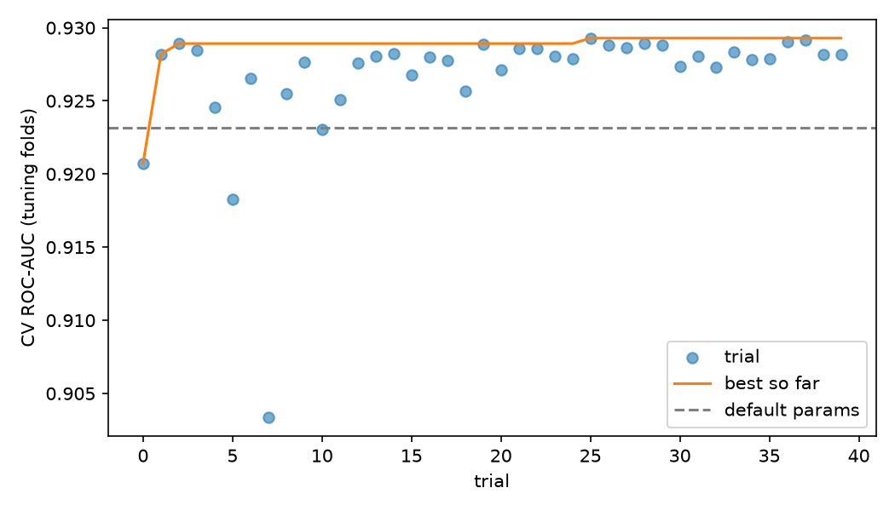
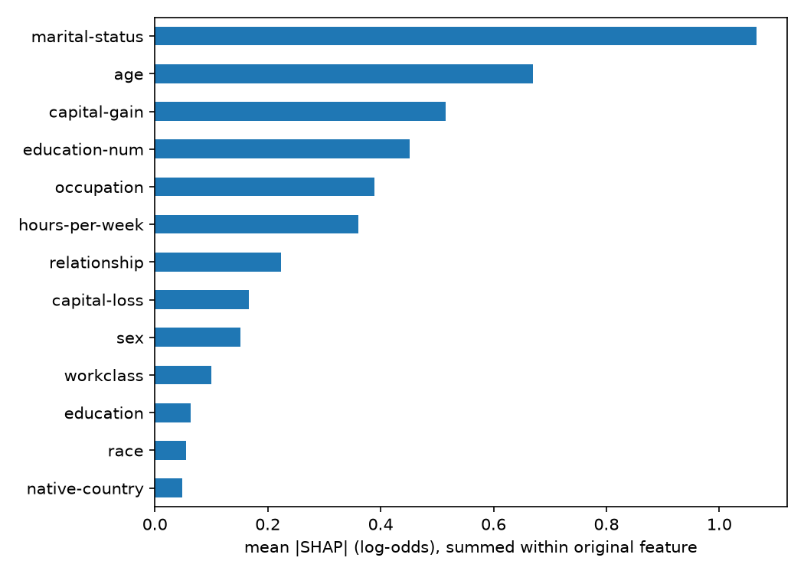
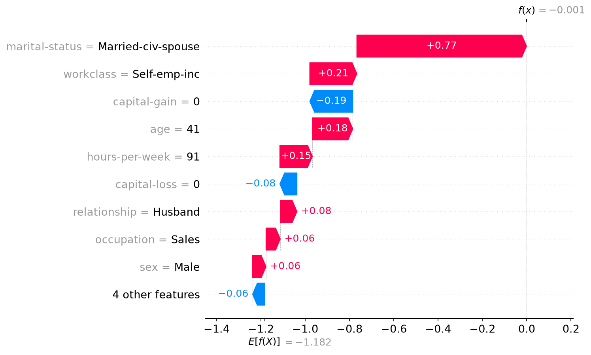
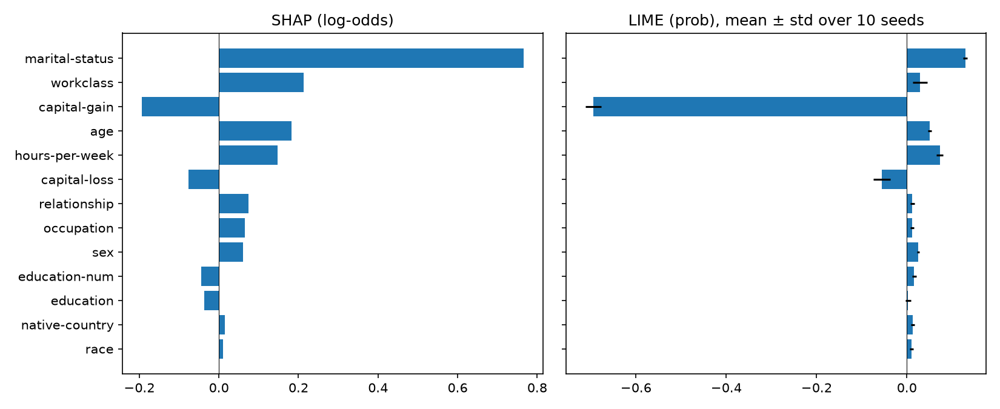

# income-model-audit

Ensemble learning, hyperparameter optimization, and explainability on the Adult Income dataset.

## Context

This repo is my submission for this week's deliverable for the Flexisaf internship. The brief was to build at least two models using the advanced machine learning techniques listed in the learning outcome.

I built 5 models for the main comparison, of which 4 use advanced techniques (three ensemble methods, plus XGBoost tuned with hyperparameter optimization), and 3 more XGBoost variants for the fairness audit. That is 8 models in total. The technique list in the learning outcome includes ensemble learning, hyperparameter optimization, and explainable AI, and this repo covers all three. The brief asked for two.

The task is to predict whether a person earns more than $50K a year. I use it to compare a baseline against ensembles, tune the best model, and then check what the model relies on with two explanation methods.

## Techniques covered

| Technique | Where | What I did |
|---|---|---|
| Ensemble learning | `notebooks/01`, `notebooks/04` | Random Forest (bagging), XGBoost (boosting), and a stacking model, against a logistic regression baseline |
| Hyperparameter optimization | `notebooks/02` | Optuna (TPE sampler), 40 trials, 8 XGBoost parameters, scored by cross-validated ROC-AUC |
| Explainable AI | `notebooks/03` | SHAP (global and one local case), permutation importance as a cross-check, LIME on the same case |
| Fairness audit (extra) | `notebooks/05`, `src/fairness.py` | Group metrics by sex and race, and a test of what happens when sensitive columns and their proxies are removed |

## Models built

| # | Model | Technique | Notebooks |
|---|---|---|---|
| 1 | Logistic regression | Baseline, not an advanced technique | 01, 04 |
| 2 | Random forest | Ensemble learning (bagging) | 01, 04 |
| 3 | XGBoost, default parameters | Ensemble learning (boosting) | 01, 04 |
| 4 | Stacking (random forest + XGBoost → logistic regression) | Ensemble learning (stacking) | 01, 04 |
| 5 | XGBoost, tuned with Optuna | Ensemble learning + hyperparameter optimization | 02, 04 |
| 6 | XGBoost, tuned parameters, without `sex` and `race` | Fairness audit variant | 05 |
| 7 | Same, also without `relationship` | Fairness audit variant | 05 |
| 8 | Same, also without `marital-status` | Fairness audit variant | 05 |

Explainable AI (SHAP, permutation importance, LIME) is applied to model 5 and does not add a model.

How I counted: each row is a distinct model configuration. Cross-validation refits each configuration several times, and the Optuna search evaluated 40 candidate parameter sets. I count neither as separate models. LIME fits small local linear models around each explained row, and the fairness audit fits logistic regressions to test how well sex can be predicted from the other features. Those are analysis tools, so I did not count them.

## Data

Adult Income, version 2 from OpenML, loaded with `fetch_openml` so nothing needs to be downloaded by hand. 48,842 rows, 13 features after dropping `fnlwgt` (a census sampling weight). 23.9% of rows are positive (>50K).

- 80/20 stratified split with seed 42: 39,073 train rows, 9,769 test rows.
- Missing values in categorical columns are filled with a `"Missing"` category before the split. This is a constant, so nothing is learned from the data.
- The test set was used once, at the end (notebook 04), for models that were already fixed. All model selection and tuning used cross-validation on the training set.

## How to run

Tested with Python 3.12.3.

```bash
python -m venv .venv
source .venv/bin/activate        # Windows PowerShell: .venv\Scripts\Activate.ps1
pip install -r requirements.txt

# quick checks from the repo root
python -m src.data
python -m src.models
python -m src.explain
```

Then run the notebooks in order (01, 02, 03, 04). Notebook 02 takes roughly 5-15 minutes and notebook 04 takes a few minutes because of stacking. Notebook 03 reads `results/best_xgb_params.json`, which notebook 02 writes and which is already committed.

## Results

### Cross-validation on the training set (5-fold, stratified)

| Model | ROC-AUC | PR-AUC | F1 (threshold 0.5) | Fit time per fold (s) |
|---|---|---|---|---|
| Logistic regression (baseline) | 0.9064 ± 0.0043 | 0.7653 ± 0.0123 | 0.6589 ± 0.0110 | 0.5 |
| Random forest (300 trees, untuned) | 0.8910 ± 0.0058 | 0.7339 ± 0.0120 | 0.6558 ± 0.0063 | 17.5 |
| XGBoost (defaults, 300 trees) | 0.9242 ± 0.0030 | 0.8191 ± 0.0070 | 0.7042 ± 0.0099 | 1.0 |
| Stacking (RF + XGBoost → logistic regression) | 0.9239 ± 0.0031 | 0.8185 ± 0.0071 | 0.6978 ± 0.0089 | 110.7 |

Because the classes are 76/24, I report ROC-AUC and PR-AUC as the main metrics. Accuracy would be about 76% for a model that always predicts "<=50K". F1 is at the default 0.5 threshold, which I did not tune.

Stacking tied XGBoost (a difference of 0.0003, inside the fold-to-fold spread) while taking about 110 times longer to fit. The random forest finished below the logistic regression. It was run with default settings, so this says something about that configuration, not about bagging in general.

### Hyperparameter optimization



- The best score reached about 0.929 by trial 2 and improved by roughly 0.0004 after that. Many configurations cluster between 0.9275 and 0.929, so more trials would probably not have helped much.
- The best trial's score is biased upward because it is the maximum over 40 noisy evaluations, so I do not use it as the tuned result. I re-scored default and tuned parameters on fresh folds (seed 123, 5 folds × 3 repeats):

| | ROC-AUC |
|---|---|
| Default XGBoost | 0.9240 ± 0.0034 |
| Tuned XGBoost | 0.9293 ± 0.0035 |
| Paired difference | +0.0053 ± 0.0007, tuned better in 15/15 folds |

The 15 folds come from repeats of the same data, so they are not independent, and the rows overlap with the data the search used. The honest read is a small, consistent gain. Best parameters are in `results/best_xgb_params.json`.

### Final evaluation on the test set

| Model | ROC-AUC | 95% CI | PR-AUC | F1 (0.5) |
|---|---|---|---|---|
| Logistic regression (baseline) | 0.9055 | [0.8994, 0.9120] | 0.7665 | 0.6633 |
| Random forest | 0.8943 | [0.8873, 0.9012] | 0.7502 | 0.6693 |
| XGBoost (defaults) | 0.9270 | [0.9215, 0.9326] | 0.8281 | 0.7132 |
| XGBoost (tuned) | 0.9307 | [0.9255, 0.9362] | 0.8350 | 0.7175 |
| Stacking | 0.9269 | [0.9214, 0.9325] | 0.8285 | 0.7113 |

Paired bootstrap on the same resampled test rows (1,000 resamples):

| Comparison | ROC-AUC difference | 95% CI |
|---|---|---|
| Tuned XGBoost − default XGBoost | +0.0038 | [0.0021, 0.0056] |
| Default XGBoost − logistic regression | +0.0215 | [0.0179, 0.0251] |
| Stacking − default XGBoost | −0.0001 | [−0.0006, 0.0004] |

The intervals only reflect noise from the test sample. They do not cover variation from the training split or random seeds.

Takeaways:
- Moving from logistic regression to XGBoost gained about 0.02 AUC. Tuning added about 0.004 on top. Model choice mattered much more than tuning here.
- Tuning helped, but less on the test set (+0.0038) than in cross-validation (+0.0053).
- Stacking gave no measurable gain over XGBoost and cost far more compute. I did not test why. My guess is that the two base models are too similar for the meta-learner to add anything.

### Explainability

All explanations use the tuned XGBoost trained on the full training set, and SHAP values are computed on a 2,000-row sample of the training data (so they describe model behavior on training rows).

**Global importance, two methods**



| Feature | SHAP rank | Permutation rank |
|---|---|---|
| marital-status | 1 | 1 |
| age | 2 | 3 |
| capital-gain | 3 | 2 |
| education-num | 4 | 4 |
| occupation | 5 | 5 |
| hours-per-week | 6 | 7 |
| relationship | 7 | 8 |
| capital-loss | 8 | 6 |
| sex | 9 | 10 |
| workclass | 10 | 9 |
| education | 11 | 13 |
| race | 12 | 11 |
| native-country | 13 | 12 |

Rank correlation is about 0.96. The top five features are the same under both methods. The bottom three have permutation AUC drops of 0.0009 or less, so their order is noise and I read them only as the least influential group.

Things to keep in mind when reading this:
- `education` and `education-num` encode the same information, so the credit is split between them. Their combined effect is larger than either bar.
- `relationship` has the levels Husband and Wife, and `marital-status` also correlates with sex. SHAP gives `sex` itself a mean |SHAP| of 0.152, but permutation importance gives it only a 0.0022 AUC drop. SHAP measures how far a feature moves the log-odds, and AUC only reacts when the ranking changes, so the two need not agree. The fairness audit below measures how much of sex can still be recovered once these columns are removed.
- SHAP values are in log-odds. They describe what the model uses, not what causes income.

**One borderline case, SHAP vs LIME**

I picked the training row closest to a predicted probability of 0.5 (row 28766, P = 0.4998), because confident predictions are one-sided and less informative.




- LIME was run with 10 seeds. Its local linear model fits this row only moderately: R² is between 0.63 and 0.67, and it predicts 0.32-0.37 where the model says 0.50. I treat LIME's weights here as a rough guide.
- LIME is stable across seeds: `capital-gain` was the top feature in 10 of 10 runs, and the mean rank correlation between seeds is 0.895.
- SHAP and LIME agree on the sign for 11 of 13 features (rank correlation 0.80). The two that differ are `education` and `education-num`, which have small weights and are near-duplicates.
- Biggest disagreement: LIME puts `capital-gain` first by a wide margin (weight −0.69, about five times the next feature), while SHAP ranks it third (−0.19 log-odds) and puts `marital-status` first. A possible reason is that 91.8% of rows have zero capital gain. LIME compares this row against a neighborhood where capital gain is resampled, and the rare non-zero samples get very high predictions, which would make "zero" look strongly negative. I did not test this.
- `workclass` is another gap (SHAP rank 2, LIME rank 6 and not stable across seeds). I have no explanation for it.
- LIME weights are on a probability scale and SHAP is in log-odds, so I compare only signs and ranks.

This is one row. It shows how the methods behave on a single case, not which method is better in general.

## Fairness audit

The dataset has `sex` and `race` columns, so I checked how the tuned XGBoost behaves across groups and tested whether just dropping those columns helps.

Setup: out-of-fold predictions on the training set (5-fold, so every row is scored by a model that did not see it), the tuned XGBoost parameters reused for every variant (they were tuned with all features and not re-tuned per variant), and a fixed 0.5 threshold. The test set was not used. Confidence intervals come from 1,000 bootstrap resamples of the rows and only reflect noise in the evaluation rows, not variation from training or random seeds. Everything below is one model and one seed.

### The labels already differ by sex

30.4% of men and 10.9% of women in the training data have income above $50K (a gap of 0.195). A model that tracks the labels will select men more often, so a selection gap alone cannot be read as the model's own bias.

### All-features model, by sex

| | n | base rate | selection rate | TPR | FPR | AUC |
|---|---|---|---|---|---|---|
| Male | 26,140 | 0.304 | 0.259 | 0.663 | 0.082 | 0.910 |
| Female | 12,933 | 0.109 | 0.081 | 0.582 | 0.019 | 0.949 |

- In absolute terms, the selection gap (0.178) is slightly smaller than the label gap (0.195). As a ratio it is slightly larger: men are selected 3.2 times as often as women, against a base-rate ratio of 2.8.
- At the 0.5 threshold, women with income above $50K are found less often than men (TPR 0.582 vs 0.663), and women are also falsely flagged less often (FPR 0.019 vs 0.082).
- AUC is higher for women (0.949 vs 0.910), so the model ranks women at least as well as men. The TPR and FPR differences come from where the fixed threshold lands for each group. I did not test other thresholds or group-specific thresholds.

### What happens when sensitive columns are dropped

Gaps are male minus female, with 95% bootstrap intervals. The last column is how well sex can be predicted from the remaining features (logistic regression, 5-fold ROC-AUC on the training set). That is a lower bound, since a stronger model could recover more.

| Variant | ROC-AUC | F1 (0.5) | Selection gap | TPR gap | FPR gap | Sex predictable from remaining features |
|---|---|---|---|---|---|---|
| All features | 0.9289 | 0.7090 | +0.178 [+0.171, +0.185] | +0.080 [+0.053, +0.107] | +0.063 [+0.059, +0.068] | 0.929 (all features except sex) |
| Drop sex, race | 0.9282 | 0.7078 | +0.174 [+0.168, +0.181] | +0.064 [+0.036, +0.091] | +0.062 [+0.057, +0.066] | 0.929 |
| Also drop relationship | 0.9271 | 0.7072 | +0.191 [+0.185, +0.198] | +0.138 [+0.110, +0.165] | +0.070 [+0.066, +0.075] | 0.857 |
| Also drop marital-status | 0.8877 | 0.6169 | +0.109 [+0.102, +0.115] | +0.070 [+0.042, +0.098] | +0.010 [+0.006, +0.015] | 0.791 |

Paired changes against the all-features model (same resampled rows):

| Variant | Selection gap change | TPR gap change | FPR gap change |
|---|---|---|---|
| Drop sex, race | −0.004 [−0.006, −0.002] | −0.016 [−0.026, −0.007] | −0.001 [−0.003, +0.000] |
| Also drop relationship | +0.013 [+0.011, +0.016] | +0.058 [+0.042, +0.074] | +0.007 [+0.005, +0.010] |
| Also drop marital-status | −0.069 [−0.075, −0.063] | −0.010 [−0.043, +0.018] | −0.053 [−0.058, −0.047] |

What I take from this:
- **Dropping `sex` and `race` changes very little.** AUC falls by 0.0007 and the gaps shrink slightly (selection −0.004, TPR −0.016). The changes are detectable but small, which fits their low permutation importance.
- **Removing the columns does not remove the information.** With `sex` and `race` gone, sex can still be predicted from the other features at AUC 0.929. Dropping `relationship` lowers that to 0.857, and also dropping `marital-status` lowers it to 0.791. `marital-status` was dropped after `relationship`, so I did not measure it on its own. Even with all four columns gone, sex is still recoverable at 0.791 from the remaining features. I did not check which ones carry it.
- **Removing `relationship` made the TPR gap larger** (+0.058 against the all-features model), even though sex became less predictable. I do not know why. The TPR gap across the four variants (0.080, 0.064, 0.138, 0.070) does not move in one direction, so I do not read it as a trend.
- **Removing `marital-status` as well cuts the selection and FPR gaps but costs accuracy.** ROC-AUC drops by 0.041 and F1 from 0.709 to 0.617, and the TPR gap change includes 0. `marital-status` was the most important feature under both SHAP and permutation importance. Smaller gaps from a clearly worse model are not evidence of a fairer one. I did not check how much of the smaller gap comes from the model selecting fewer people overall.

### Race

Measured for the all-features model only, with no confidence intervals.

| Race | n | positives | base rate | selection rate | TPR | FPR |
|---|---|---|---|---|---|---|
| White | 33,450 | 8,503 | 0.254 | 0.214 | 0.656 | 0.063 |
| Black | 3,717 | 437 | 0.118 | 0.083 | 0.549 | 0.021 |
| Asian-Pac-Islander | 1,208 | 327 | 0.271 | 0.246 | 0.679 | 0.085 |
| Amer-Indian-Eskimo | 374 | 42 | 0.112 | 0.067 | 0.452 | 0.018 |
| Other | 324 | 40 | 0.123 | 0.083 | 0.550 | 0.018 |

Amer-Indian-Eskimo and Other have about 40 positive cases each, so their TPRs rest on roughly 20 people and I do not interpret them. I did not re-run the race comparison under the dropped-column variants.

### What this audit does and does not show

- I describe the gaps. I do not call the model fair or unfair. When base rates differ between groups, equal selection rates, equal TPRs and equal FPRs cannot all hold at once unless the predictions are perfect, so there is no single "fair" number here.
- I tested one baseline approach (dropping columns) and no mitigation methods such as reweighting or group-specific thresholds.
- The labels come from 1994 census data and carry the pay gaps of that period

## A bug I found and what I learned from it

My first SHAP results were wrong. The pipeline one-hot encodes categorical features and passes a sparse matrix to XGBoost, but my SHAP code densified that matrix first. Predictions from the dense matrix differed from `pipeline.predict_proba` by up to 0.82 on 1,093 of 2,000 rows, so SHAP was explaining a different function than the one I trained. It showed up as `native-country` ranking third in importance, which did not match permutation importance, and a waterfall whose final value contradicted the row's predicted probability.

What I changed:
- The preprocessor now outputs a dense array (`sparse_threshold=0`).
- `explain_shap` now raises an error if SHAP values plus the base value do not reproduce `pipeline.predict_proba`. My original check compared SHAP against the same dense matrix it came from, so it could not catch this.

I then re-ran the cross-validation for default and tuned XGBoost with the fix, and the per-fold scores were identical to the earlier ones (differences of 1e-16). So the bug affected only the explanations, not the reported metrics. I did not work out why training was unaffected while dense and sparse inference disagreed, so I do not claim a mechanism.

## Limitations

- Adult is 1994 census data and a widely used benchmark. The labels reflect the income patterns of that period.
- The random forest and stacking models were not tuned. Only XGBoost was.
- Explanations are shown for one local case and on training rows.
- The fairness audit covers sex (with intervals) and race (descriptive only), for one model and one seed, with no mitigation methods tested.

## Repo layout

```
income-model-audit/
├── README.md
├── requirements.txt
├── notebooks/
│   ├── 01_baseline_and_ensembles.ipynb
│   ├── 02_hyperparameter_optimization.ipynb
│   ├── 03_explainability_shap_lime.ipynb
│   |── 04_final_test_evaluation.ipynb
│   └── 05_fairness_audit.ipynb
├── src/
│   ├── data.py          # loading and splitting
|   |──fairness.py      # group metrics and proxy-leakage check
│   ├── models.py        # baseline and ensemble pipelines
│   ├── tuning.py        # Optuna search
│   ├── explain.py       # SHAP with a check against the pipeline
│   └── lime_utils.py    # LIME bridge to the pipeline
├── results/             # CSVs behind every number above
└── figures/
```

## Author

**Abdulrahman Hayatu Usman**
BSc Computer Science — Ahmadu Bello University, Zaria

[](https://linkedin.com/in/abdulrahman-hayatu)
[](https://github.com/Abdulrahman-Hayatu)
[](mailto:hayatuusmanabdulrahman@gmail.com)

---